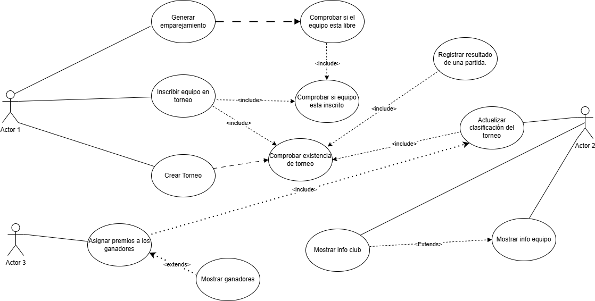
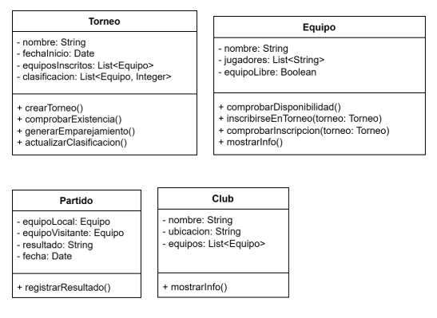

# Sistema de Gestión de Torneos de eSports

## Autor
  Francisco José Soria Navarrete
  AirooSs

## Descripción del Proyecto
  Primero contesté a las preguntas propuestas en el pdf del trabajo.
  Posteriormente, hice tanto el diagrama de casos de uso como el de clases en draw.io, organizando cada clase con su correspondiente relación entre ellas y el actor.
  Por último, he creado el repositorio de GitHub para este trabajo ordenando las tareas como las he entendido.

Link al repositorio del proyecto: https://github.com/AirooSs/torneo-esports-uml.git

Este proyecto implementa un sistema de gestión de torneos de eSports utilizando UML para el modelado y Java para la implementación.

## Diagramas UML
  ### Diagrama de Casos de Uso
  
### Diagrama de Clases
  

## Estructura del Proyecto

torneo-esports-uml/ ├── src/
│ ├── es/empresa/torneo/ 
│ │ ├── modelo/ 
│ │ ├── control/ 
│ │ ├── vista/
│ │ ├── Main.java
├── diagrams/ 
│ ├── casos-uso.png 
│ ├── clases.png
├── README.md
├── .gitignore

## Instalación y Ejecución
  1. Clonar el repositorio: `git clone https://github.com/usuario/torneo-esports-uml.git`

  2. Compilar y ejecutar el proyecto: `cd src javac es/empresa/torneo/Main.java java es.empresa.torneo.Main`

## Justificación del diseño Por qué se eligió esa estructura y cómo se organizan las clases.
  Elegí una estructura basada en el patrón Modelo-Vista-Controlador (MVC) para separar responsabilidades y mejorar la mantenibilidad del sistema.
  Esta organización favorece el mantenimiento y la claridad del sistema, permitiendo cambios en una capa sin afectar a las demás de manera directa.
## Conclusiones
  En este proyecto he aprendido a organizar de manera mas visual tanto metodos de un programa, como clases y atributos; ya sea viendo como se relacionan entre si y como depende uno de      otro.

